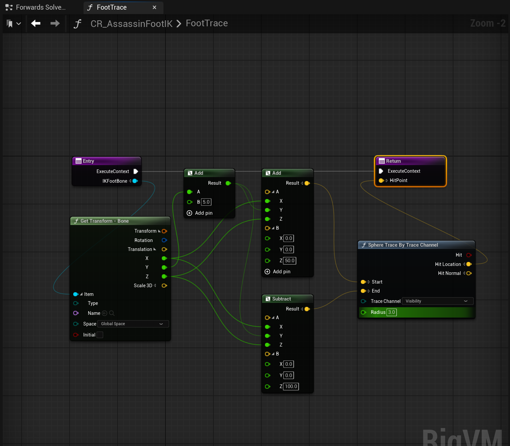

# UE基础

## 基础操作

### 游戏运行时

E 上升 C 下降\
shift f1 退出游戏不中断\
shift ESC 退出游戏

### 编辑器

`ctrl space`显示内容栏

`按住鼠标左键+前后移`=前后移动\
`左右移`=视角左右移动\
**水平高度不变**

按住右键改变视角角度不改变移动

`同时按住左右键+前后移`=上升,下降\
`左右移`=左右移动,视角方向不变

`按住鼠标左或右键+c`=放大中心点视角,松开鼠标还原

`g`:切换游戏视图

**Bookmarks**\
ctrl+(0-9)设置书签,即固定摄像头位置

`选中物体+按住alt键拖动物体`可复制出一个同样的物体,也可旋转复制\
`按住shift点击多个物体`可对多个物体同时进行操作

`f`:选中物体点击f后可快速贴近观察物体

## 基础知识

- 摄像头速度=视角移动速度
- 坐标系用的是左手坐标系
- UE中一单位=1cm
- 头文件必须放在.generated.h前面

## Visual Studio设置

### 注意

- **一定要取消热重载**
- **最好取消实时编译**
**容易出问题的地方**
- 改变`UPROPERTY`参数时使用热重载会崩溃
- 改变蓝图类结构(添加成员)使用热重载可能会崩溃

**解决办法:** 退出UE编辑器,在vs中编译并启动UE

## 创建蓝图类

先创建c++类然后创建基于c++的蓝图类

## 调试

- **临时日志输出**:

```cpp
UE_LOG(LogTemp, Warning, TEXT("Begin Play called!"));
```

临时日志中以警告方式出现

- **屏幕输出**

```cpp
if (GEngine)
{
 GEngine->AddOnScreenDebugMessage(1, 60.f, FColor::Red, FString("String on Screen!"));
}
```

1是键值,对应屏幕输出位置

### 字符串格式化

```cpp
UE_LOG(LogTemp, Warning, TEXT("DeltaTime: %.2f"), DeltaTime);

if (GEngine)
{
 FString Message = FString::Printf(TEXT("DeltaTime: %f"), DeltaTime);
 GEngine->AddOnScreenDebugMessage(1, 60.f, FColor::Red, Message);
}

FString Name = GetName();
FString Message = FString::Printf(TEXT("DeltaTime: %s"), *Name);
```

**注意**:GetName()是获取实体名字的函数,*号是将FString转换成cString的运算符

## Actor

- **GetWorld()**
获取当前actor所在世界(UWorld*类型),如果没生成返回null

- **GetActorLocation()**
获取当前actor所在位置信息,返回FVector.

- **DrawDebugSphere(UWorld\*,Fvector,R(float),线段数量,Fcolor,持久性(bool)(false后面接浮点数秒数))**
画调试球体

1. **DrawDebugLine()**
2. **DrawDebugPoint()**
3. **SetActorLocation()**

传入Fvector();
**SetActorRotation(FRotator(0.f, 90.f, 0.f));**

改变角度\
**AddActorWorldOffset()**\
**AddActorWorldRotation()**

### 调试宏

```cpp
#pragma once
#include "DrawDebugHelpers.h"//这个头文件必须有

#define DRAW_SPHERE(Location) if(GetWorld()) { DrawDebugSphere(GetWorld(), Location, 50.f, 12, FColor::Red, true, -1.f); };
#define DRAW_SPHERE_SingleFrame(Location) if(GetWorld()) { DrawDebugSphere(GetWorld(), Location, 50.f, 12, FColor::Red, false, -1.f); };
#define DRAW_LINE(Start, End) if(GetWorld()) { DrawDebugLine(GetWorld(), Start, End, FColor::Red, true, -1.f); };
#define DRAW_LINE_SingleFrame(Start, End) if(GetWorld()) { DrawDebugLine(GetWorld(), Start, End, FColor::Red, false, -1.f); };
#define DRAW_POINT(Location) if(GetWorld()) { DrawDebugPoint(GetWorld(), Location, 10.f, FColor::Red, true, -1.f); };
#define DRAW_POINT_SingleFrame(Location) if(GetWorld()) { DrawDebugPoint(GetWorld(), Location, 10.f, FColor::Red, false, -1.f); };
#define DRAW_VECTOR(Start,End) if(GetWorld()) { DrawDebugDirectionalArrow(GetWorld(), Start, End, 50.f, FColor::Red, true, -1.f); };
#define DRAW_VECTOR_SingleFrame(Start,End) if(GetWorld()) { DrawDebugDirectionalArrow(GetWorld(), Start, End, 50.f, FColor::Red, false, -1.f); };
```

```cpp
void AItem::Tick(float DeltaTime)
{
 Super::Tick(DeltaTime);
 float speed = 50.f;
 float swift = 45.f;
 AddActorWorldRotation(FRotator(swift * DeltaTime, 0.f,  0.f));
 //避免帧数不同导致单位之间内位移量不同
 AddActorWorldOffset(FVector(speed * DeltaTime, 0.f, 0.f));
 DRAW_SPHERE_SingleFrame();
 DRAW_VECTOR_SingleFrame();
}
```

### 正弦函数产生循环

```cpp
void AItem::Tick(float DeltaTime)
{
 Super::Tick(DeltaTime);
 RunningTime += DeltaTime;
 float DeltaZ = Amplitude * FMath::Sin(TimeConstant * RunningTime);
 AddActorWorldOffset(FVector(0.f, 0.f, DeltaZ));
 DRAW_SPHERE_SingleFrame();
 DRAW_VECTOR_SingleFrame();
}
```

### c++属性添加到蓝图属性栏

```cpp
//只能修改默认值,在蓝图中修改
UPROPERTY(EditDefaultsOnly)
//能修改单个实例属性
UPROPERTY(EditInstanceOnly)
//两边都能修改
UPROPERTY(EditAnywhere)
//只能查看不能修改 
UPROPERTY(VisibleDefaultsOnly)
```

### 暴露c++属性到蓝图图表中

要使用读写功能属性不能是私有
Category参数改变该属性所在蓝图属性栏目名称

```cpp
UPROPERTY(EditAnywhere,BlueprintReadOnly,Category="name")//只读
UPROPERTY(EditAnywhere,BlueprintReadWrite)//读写
UPROPERTY(EditAnywhere,BlueprintReadOnly,meta=(AllowPrivateAcess = "true"))//让私有变量可以在蓝图中被访问,UE5.5似乎没有该meta功能
```

### 暴露c++类函数到蓝图图表中

```cpp
UFUNCTION(BlueprintCallable)//适用于修改状态的操作(如触发事件、改变变量)
UFUNCTION(BlueprintPure)//适用于数据获取、计算、逻辑判断等无状态的操作
```

### C++Template

```cpp
Template <typename T>
T Avg(T a,T b)
{
    return (a+b)>>1;
}
int result = <Avg<int>(1,2);
```

### Component

```cpp
UPROPERTY(VisibleAnywhere)//参与反射回收,暴露给编辑器
UStaticMeshComponent* ItemMesh;

//工厂模式,相当于new,TEXT里面是名称
ItemMesh = CreateDefaultSubobject<UStaticMeshComponent>(TEXT("ItemMesh"));
//根组件被回收,ItemMesh成为根
RootComponent = ItemMesh;
```

实际使用一般是c++创组件,蓝图选择Mesh

## Pawn

### Capsule 胶囊组件

**头文件:**`#include "Components/CapsuleComponent.h"`

.h文件中

```cpp
private:
UPROPERTY(VisibleAnywhere)
UCapsuleComponent* Capsule;
```

.cpp文件中,构造函数里面

```cpp
Capsule = CreateDefaultSubobject<UCapsuleComponent>(TEXT("Capsule"));
Capsule->SetCapsuleHalfHeight(20.f);//设置长度
Capsule->SetCapsuleRadius(15.f);//设置半径
SetRootComponent(Capsule);//比直接赋值应对场景多
```

### Forward Declaration

**定义:** 它允许你在文件的一部分声明一个类型(比如类、结构体、函数等),而不需要提供其完整的定义.这在大型项目中非常有用,可以减少头文件的相互依赖,加快编译速度.

防止在头文件中引用头文件导致引入过多不必要代码\
用法类似提前声明函数,后面实现\
.h文件中`class UCapsuleComponent;`\
之后便可以声明指针,在cpp文件中引用头文件

### Skeletal Mesh Components

骨骼网格组件

```cpp
//.h
class USkeletalMeshComponent;
UPROPERTY(VisibleAnywhere)
USkeletalMeshComponent* BirdMesh;
//.cpp
#include "Components/SkeletalMeshComponent.h"
ABird::ABird()
{
BirdMesh = CreateDefaultSubobject<USkeletalMeshComponent>(TEXT("BirdMesh"));
BirdMesh->SetupAttachment(GetRootComponent());//使骨骼跟根组件移动
}
```

**增加动画:** 蓝图Animation中AnimationMode选用 Use Animation Asset可以使用动画资源

### 前后移动

UE编辑器里:Edit->Project Settings->Input->AxisMappings

```cpp
//.h
void MoveForward(float Value);//要重写

//.cpp
void ABird::MoveForward(float Value)
{
    if (Controller && Value != 0.f)
    {
        FVector Forward = GetActorForwardVector();
        AddMovementInput(Forward, Value);
    }
}

void ABird::SetupPlayerInputComponent(UInputComponent* PlayerInputComponent)
{
    Super::SetupPlayerInputComponent(PlayerInputComponent);

    PlayerInputComponent->BindAxis(FName("MoveForward"), this, &ABird::MoveForward);
}
```

### Camera And Spring Arm

**蓝图中:** 添加spring arm组件和camera组件,并将camera组件拖到arm上

```cpp
//.h
//先声明
class USpringArmComponent;
class UCameraComponent;

UPROPERTY(VisibleAnywhere)
USpringArmComponent* SpringArm;

UPROPERTY(VisibleAnywhere)
UCameraComponent* ViewCamera;

//.cpp
#include "GameFramework/SpringArmComponent.h"
#include "Camera/CameraComponent.h"

Bird::ABird()
{
    PrimaryActorTick.bCanEverTick = true;
    SpringArm = CreateDefaultSubobject<USpringArmComponent>(TEXT("SpringArm"));
    SpringArm->SetupAttachment(GetRootComponent());
    SpringArm->TargetArmLength = 300.f;

    ViewCamera = CreateDefaultSubobject<UCameraComponent>(TEXT("ViewCamera"));
    ViewCamera->SetupAttachment(SpringArm);

    AutoPossessPlayer = EAutoReceiveInput::Player0;
}
```

### Add Controller Input

**内容:** 用鼠标控制控制器的角度

Edit->Project Settings->Input->Axis Mappings中,鼠标x,y,对应鼠标
左右移动速度,前后移动速度,同时要使得控制器同步变化需再Pawn蓝图中勾选`Use Controller Rotation xxx`

c++
```cpp
//.h
void Turn(float Value);
void LookUp(float Value);

//.cpp
void ABird::Turn(float Value)
{
	AddControllerYawInput(Value);//更改yaw
}

void ABird::LookUp(float Value)
{
	AddControllerPitchInput(Value);//更改pitch
}

void ABird::SetupPlayerInputComponent(UInputComponent* PlayerInputComponent)
{
	Super::SetupPlayerInputComponent(PlayerInputComponent);

	PlayerInputComponent->BindAxis(FName("Turn"), this, &ABird::Turn);//吸附
	PlayerInputComponent->BindAxis(FName("LookUp"), this, &ABird::LookUp);
}
```

### 游戏模式
一般情况下游戏用的是默认模式,也就是说会有默认Pawn出现,要想改默认模式
就需要创建一个`game mode base`类,修改后将游戏模式指定为该模式就行\
**坏处:** 在大世界中,如果你拖入的你设定的pawn实例进入另一个区域后,
会导致pawn消失,除非你回到原来区域
- 如果是全项目范围,修改 Project Settings > Maps & Modes 的 Default Pawn Class.
- 如果是单个关卡范围,修改 World Settings > Game Mode Override.
- 如果是运行时动态切换,使用蓝图或 C++ 实现.

## Character
角色默认拥有网格和骨骼

取消`Use Controller Rotation x,y,x`
```cpp
bUseControllerRotationPitch = false;
bUseControllerRotationYaw = false;
bUseControllerRotationRoll = false;
```

不取消会使角色和镜头一起移动、
**旋转弹簧臂而不使角色旋转:** `Use Pawn Controller Rotation`\
右移
```cpp
void ASlashCharacter::MoveRight(float Value)
{
	if (Controller && Value != 0.f)
	{
		FVector Right = GetActorRightVector();
		AddMovementInput(Right, Value);
	}
}
```

了解旋转矩阵概念

### Controller Directions
控制器方向同步
```cpp
void ASlashCharacter::MoveForward(float Value)
{
	if (Controller && Value != 0.f)
	{
		// find out which way is forward
		const FRotator ControllerRotation = GetControlRotation();//得到控制器方向
		const FRotator YawRotation(0.f, ControllerRotation.Yaw, 0.f);//得到单个方向

		const FVector Direction = FRotationMatrix(YawRotation).GetUnitAxis(EAxis::X);//转换成Vector,向右移动改成EAxis::Y即可
		AddMovementInput(Direction, Value);
	}
}
```
同步角色朝向和控制器方向
```cpp
#include "GameFramework/CharacterMovementComponent.h"
ASlashCharacter::ASlashCharacter()
{
	PrimaryActorTick.bCanEverTick = true;
	GetCharacterMovement()->bOrientRotationToMovement = true;//使角色朝向跟随移动方向改变
	GetCharacterMovement()->RotationRate = FRotator(0.f, 400.f, 0.f);//改变旋转速度

}
```

### Hair And Eyebrows
添加头发和眉毛到角色\
**添加前:** 在Slash.Build.cs文件中,添加`"HairStrandsCore"`在
`PublicDependencyModuleNames.AddRange`中\
生成文件(可删除)
- Binaries
- Intermediate
- Saved

每次往构建文件中添加东西,最好删掉这些再重新编译\删除后右键点击`Slash.uproject`生成解决方案,然后双击打开该项目重建模块游戏打开后关闭ue5用vs重新编译\
更改头发颜色(更改材质)

## Animation

1. 先创建动画蓝图(`Animation`->`AnimationBP`->选择骨架)
2. 打开蓝图编辑器,进入`Mesh`视图,切换`Animation Mode`->`Use Animation Blueprint`->选择刚创建的动画蓝图
3. 添加对象变量类型'BP Slash Character`
4. 添加`Event Blueprint Initialize Animation`事件,将`Try Get Pawn Owner`连到`Cast To BP_SlashCharacter`上进行转换后连到`Set Character`上,再连到`Get Character Movement`上面,创建`Character Movement Component`类型变量,最后连到`Set MovementComponent`变量上,Set相当于给变量赋值
5. ps:没找到`Get Character Movement`是因为开了`Context Sensitive`
6. //漏连set了
7. 
8. 7将Event update连到set

然后建立状态机,建立状态,加入状态动画,加入转换规则,动画记得选中循环播放

### Anim Instance

父类改为 Anim Instance\
编译任何动画实例修改前先关闭编辑器,蓝图中的update函数是一直运行的,会影响c++,出现终端删除缓存文件删除`.vs`,`sln`,启动ue5后重新打开解决方案,关闭ue5再强制编译`(ctrl+f5)`

```cpp
//.h
#pragma once

#include "CoreMinimal.h"
#include "Animation/AnimInstance.h"
#include "SlashAnimInstance.generated.h"

/**
 * 
 */
UCLASS()
class SLASH_API USlashAnimInstance : public UAnimInstance
{
	GENERATED_BODY()

public:
	virtual void NativeInitializeAnimation() override;
	virtual void NativeUpdateAnimation(float DeltaTime) override;
	
	UPROPERTY(BlueprintReadOnly)
	class ASlashCharacter* SlashCharacter;

	UPROPERTY(BlueprintReadOnly, Category = "Movement")
	class UCharacterMovementComponent* SlashCharacterMovement;

	UPROPERTY(BlueprintReadOnly, Category = "Movement")
	float GroundSpeed;
};
```

```cpp
//.cpp
// Fill out your copyright notice in the Description page of Project Settings.


#include "Characters/SlashAnimInstance.h"
#include "Characters/SlashCharacter.h"
#include "GameFramework/CharacterMovementComponent.h"
#include "Kismet/KismetMathLibrary.h"

void USlashAnimInstance::NativeInitializeAnimation()
{
	Super::NativeInitializeAnimation();

	SlashCharacter = Cast<ASlashCharacter>(TryGetPawnOwner());//类型转换
	if (SlashCharacter)
	{
		SlashCharacterMovement = SlashCharacter->GetCharacterMovement();//获取移动组件
	}
}

void USlashAnimInstance::NativeUpdateAnimation(float DeltaTime)
{
	Super::NativeUpdateAnimation(DeltaTime);

	if (SlashCharacterMovement)
	{
		GroundSpeed = UKismetMathLibrary::VSizeXY(SlashCharacterMovement->Velocity);//获取速度
	}
}
```

### Jump
使用`Action Mappings`,适用于单次操作触发的动作,同时会生成一个 `Jump`蓝图时间类属`Action Event`\
**蓝图:** 直接在角色蓝图中将`Jump`函数连接到内置的`Character::Jump`函数上\
**c++:**`SlashCharacter`中绑定`Jump`函数,用系统自带函数获取IsFalling变量信息,将移动的状态机存在缓存中,在创建主状态机包含地面状态和空中状态.

### Inverse Kinematics
解决上楼梯脚步悬空问题\
先创建一个`Animation`的Controll Rig,在`Forward Slove Graph`导入相应角色`Mesh`,在里面创建函数`IKFootTrace`,
不会碰到Bone可能是因为以本身做碰撞检测


最低点是离地最近的\
将`ShouldDoIKTrace`设为全局可看


`settings`那里改成`pin to input`

微调需要在`FootTrace`函数里面调增碰撞检测起点和终点\
**脚掌贴地面**未实现

## Section 9

### Collision Presets
1. 拖动网格体进世界会自动生成`Actor`类,默认带网格体组件,网格体组件里面有`Collision Presets`选项
- `No Collsion`有碰撞
- `Query`仅可以进行空间查询,上一节检测脚到地面距离,属于简单碰撞,可阻挡
- `Physic`无碰撞
- `Enable`两者都发生

### Collision Responses
对各种对象的碰撞反应

### OverlapEvents
重叠事件
`On Component Begin Overlap`某个物体发生重叠时发生的事件


### On Component Begin Overlap
1. 解决方案中搜素`PrimitiveComponent.h`文件中找到对应委托的参数列表
2.  声明函数
3.  绑定函数
```cpp
//Item.h
class USphereComponent;
UPROPERTY(VisibleAnywhere)
USphereComponent* Sphere;

//Item.cpp
#include "Components/SphereComponent.h"

AItem::AItem()
{
	rimaryActorTick.bCanEverTick = true;
	Sphere = CreateDefaultSubobject<USphereComponent>(TEXT("Shere"));
	Sphere->SetupAttachment(GetRootComponent());

}

void AItem::BeginPlay()
{
	Super::BeginPlay();

	//绑定回调函数到委托
	Sphere->OnComponentBeginOverlap.AddDynamic(this, &AItem::OnSphereOverlap);
}

void AItem::OnSphereOverlap(UPrimitiveComponent* OverlappedComponent, AActor* OtherActor, UPrimitiveComponent* OtherComp, int32 OtherBodyIndex, bool bFromSweep, const FHitResult& SweepResult)
{
	const FString OtherActorName = OtherActor->GetName();
	if (GEngine)
	{
		//打印名字在屏幕上
		GEngine->AddOnScreenDebugMessage(1, 30.f, FColor::Red, OtherActorName);
	}
}
```
`End`同理

## Weapon

### The Weapon Class

`Weapon`继承`Item`,继承的函数必须是虚函数,且重载的
函数不能加`UFUNCTION`

### Sockets
插槽,找到骨骼,找到手右键`add socket`添加插槽,可以预览加上武器动画,和动作
