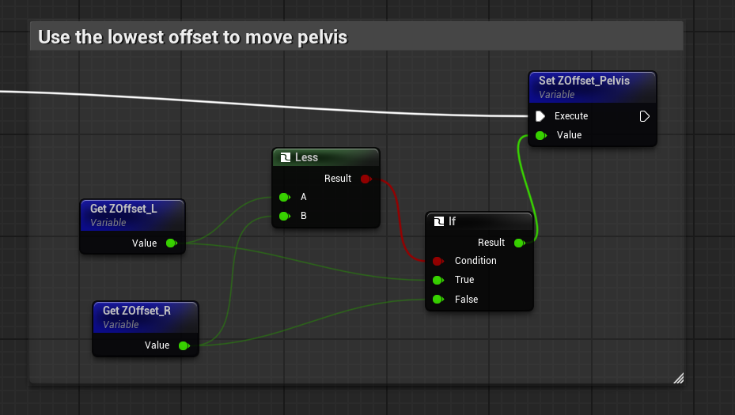
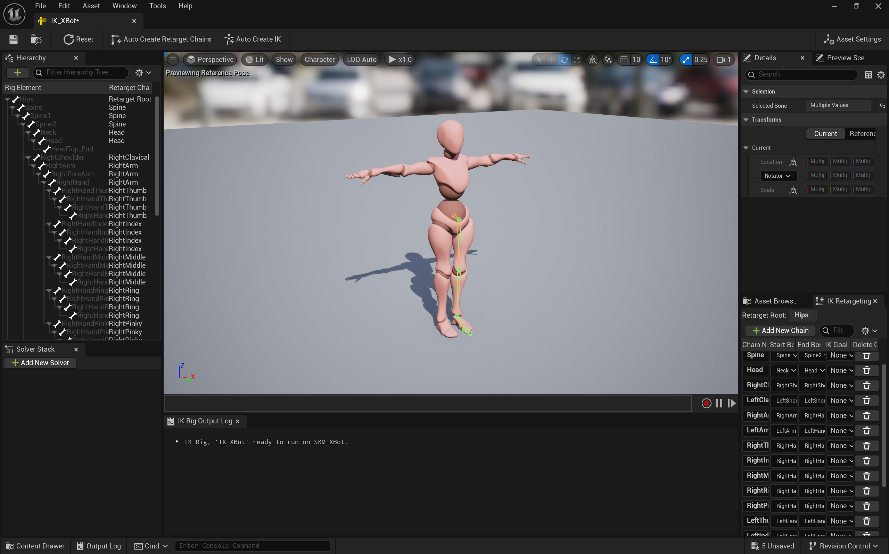
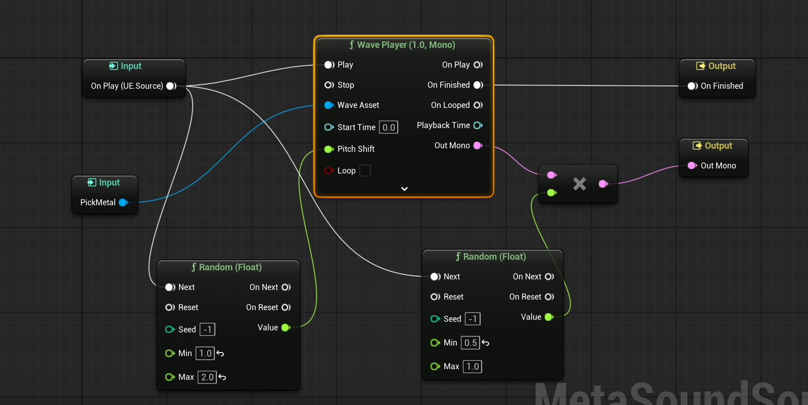
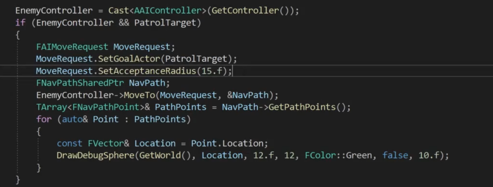
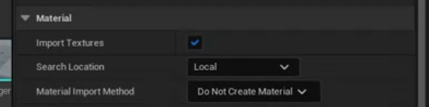
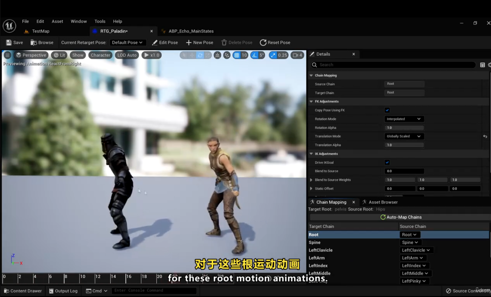

# UE基础

## 基础操作

### 游戏运行时

E 上升 C 下降\
shift f1 退出游戏不中断\
shift ESC 退出游戏

### 编辑器

`ctrl space`显示内容栏

`按住鼠标左键+前后移`=前后移动\
`左右移`=视角左右移动\
**水平高度不变**

按住右键改变视角角度不改变移动

`同时按住左右键+前后移`=上升,下降\
`左右移`=左右移动,视角方向不变

`按住鼠标左或右键+c`=放大中心点视角,松开鼠标还原

`g`:切换游戏视图

**Bookmarks**\
ctrl+(0-9)设置书签,即固定摄像头位置

`选中物体+按住alt键拖动物体`可复制出一个同样的物体,也可旋转复制\
`按住shift点击多个物体`可对多个物体同时进行操作

`f`:选中物体点击f后可快速贴近观察物体

## 基础知识

- 摄像头速度=视角移动速度
- 坐标系用的是左手坐标系
- UE中一单位=1cm
- 头文件必须放在.generated.h前面
- 命令行`show collison`查看碰撞体
- `slomo+float`放缓时间到float倍

## Visual Studio设置

### 注意

- **一定要取消热重载**
- **最好取消实时编译**
**容易出问题的地方**
- 改变`UPROPERTY`参数时使用热重载会崩溃
- 改变蓝图类结构(添加成员)使用热重载可能会崩溃

**解决办法:** 退出UE编辑器,在vs中编译并启动UE

## 创建蓝图类

先创建c++类然后创建基于c++的蓝图类

## 调试

- **临时日志输出**:

```cpp
UE_LOG(LogTemp, Warning, TEXT("Begin Play called!"));
```

临时日志中以警告方式出现

- **屏幕输出**

```cpp
if (GEngine)
{
 GEngine->AddOnScreenDebugMessage(1, 60.f, FColor::Red, FString("String on Screen!"));
}
```

1是键值,对应屏幕输出位置

### 字符串格式化

```cpp
UE_LOG(LogTemp, Warning, TEXT("DeltaTime: %.2f"), DeltaTime);

if (GEngine)
{
 FString Message = FString::Printf(TEXT("DeltaTime: %f"), DeltaTime);
 GEngine->AddOnScreenDebugMessage(1, 60.f, FColor::Red, Message);
}

FString Name = GetName();
FString Message = FString::Printf(TEXT("DeltaTime: %s"), *Name);
```

**注意**:GetName()是获取实体名字的函数,*号是将FString转换成cString的运算符

## Actor

- **GetWorld()**
获取当前actor所在世界(UWorld*类型),如果没生成返回null

- **GetActorLocation()**
获取当前actor所在位置信息,返回FVector.

- **DrawDebugSphere(UWorld\*,Fvector,R(float),线段数量,Fcolor,持久性(bool)(false后面接浮点数秒数))**
画调试球体

1. **DrawDebugLine()**
2. **DrawDebugPoint()**
3. **SetActorLocation()**

传入Fvector();
**SetActorRotation(FRotator(0.f, 90.f, 0.f));**

改变角度\
**AddActorWorldOffset()**\
**AddActorWorldRotation()**

### 调试宏

```cpp
#pragma once
#include "DrawDebugHelpers.h"//这个头文件必须有

#define DRAW_SPHERE(Location) if(GetWorld()) { DrawDebugSphere(GetWorld(), Location, 50.f, 12, FColor::Red, true, -1.f); };
#define DRAW_SPHERE_SingleFrame(Location) if(GetWorld()) { DrawDebugSphere(GetWorld(), Location, 50.f, 12, FColor::Red, false, -1.f); };
#define DRAW_LINE(Start, End) if(GetWorld()) { DrawDebugLine(GetWorld(), Start, End, FColor::Red, true, -1.f); };
#define DRAW_LINE_SingleFrame(Start, End) if(GetWorld()) { DrawDebugLine(GetWorld(), Start, End, FColor::Red, false, -1.f); };
#define DRAW_POINT(Location) if(GetWorld()) { DrawDebugPoint(GetWorld(), Location, 10.f, FColor::Red, true, -1.f); };
#define DRAW_POINT_SingleFrame(Location) if(GetWorld()) { DrawDebugPoint(GetWorld(), Location, 10.f, FColor::Red, false, -1.f); };
#define DRAW_VECTOR(Start,End) if(GetWorld()) { DrawDebugDirectionalArrow(GetWorld(), Start, End, 50.f, FColor::Red, true, -1.f); };
#define DRAW_VECTOR_SingleFrame(Start,End) if(GetWorld()) { DrawDebugDirectionalArrow(GetWorld(), Start, End, 50.f, FColor::Red, false, -1.f); };
```

```cpp
void AItem::Tick(float DeltaTime)
{
 Super::Tick(DeltaTime);
 float speed = 50.f;
 float swift = 45.f;
 AddActorWorldRotation(FRotator(swift * DeltaTime, 0.f,  0.f));
 //避免帧数不同导致单位之间内位移量不同
 AddActorWorldOffset(FVector(speed * DeltaTime, 0.f, 0.f));
 DRAW_SPHERE_SingleFrame();
 DRAW_VECTOR_SingleFrame();
}
```

### 正弦函数产生循环

```cpp
void AItem::Tick(float DeltaTime)
{
 Super::Tick(DeltaTime);
 RunningTime += DeltaTime;
 float DeltaZ = Amplitude * FMath::Sin(TimeConstant * RunningTime);
 AddActorWorldOffset(FVector(0.f, 0.f, DeltaZ));
 DRAW_SPHERE_SingleFrame();
 DRAW_VECTOR_SingleFrame();
}
```

### c++属性添加到蓝图属性栏

```cpp
//只能修改默认值,在蓝图中修改
UPROPERTY(EditDefaultsOnly)
//能修改单个实例属性
UPROPERTY(EditInstanceOnly)
//两边都能修改
UPROPERTY(EditAnywhere)
//只能查看不能修改 
UPROPERTY(VisibleDefaultsOnly)
```

### 暴露c++属性到蓝图图表中

要使用读写功能属性不能是私有
Category参数改变该属性所在蓝图属性栏目名称

```cpp
UPROPERTY(EditAnywhere,BlueprintReadOnly,Category="name")//只读
UPROPERTY(EditAnywhere,BlueprintReadWrite)//读写
UPROPERTY(EditAnywhere,BlueprintReadOnly,meta=(AllowPrivateAcess = "true"))//让私有变量可以在蓝图中被访问,UE5.5似乎没有该meta功能
```

### 暴露c++类函数到蓝图图表中

```cpp
UFUNCTION(BlueprintCallable)//适用于修改状态的操作(如触发事件、改变变量)
UFUNCTION(BlueprintPure)//适用于数据获取、计算、逻辑判断等无状态的操作
```

### C++Template

```cpp
Template <typename T>
T Avg(T a,T b)
{
    return (a+b)>>1;
}
int result = Avg<int>(1,2);
```

### Component

```cpp
UPROPERTY(VisibleAnywhere)//参与反射回收,暴露给编辑器
UStaticMeshComponent* ItemMesh;

//工厂模式,相当于new,TEXT里面是名称
ItemMesh = CreateDefaultSubobject<UStaticMeshComponent>(TEXT("ItemMesh"));
//根组件被回收,ItemMesh成为根
RootComponent = ItemMesh;
```

实际使用一般是c++创组件,蓝图选择Mesh

## Pawn

### Capsule 胶囊组件

**头文件:**`#include "Components/CapsuleComponent.h"`

.h文件中

```cpp
private:
UPROPERTY(VisibleAnywhere)
UCapsuleComponent* Capsule;
```

.cpp文件中,构造函数里面

```cpp
Capsule = CreateDefaultSubobject<UCapsuleComponent>(TEXT("Capsule"));
Capsule->SetCapsuleHalfHeight(20.f);//设置长度
Capsule->SetCapsuleRadius(15.f);//设置半径
SetRootComponent(Capsule);//比直接赋值应对场景多
```

### Forward Declaration

**定义:** 它允许你在文件的一部分声明一个类型(比如类、结构体、函数等),而不需要提供其完整的定义.这在大型项目中非常有用,可以减少头文件的相互依赖,加快编译速度.

防止在头文件中引用头文件导致引入过多不必要代码\
用法类似提前声明函数,后面实现\
.h文件中`class UCapsuleComponent;`\
之后便可以声明指针,在cpp文件中引用头文件

### Skeletal Mesh Components

骨骼网格组件

```cpp
//.h
class USkeletalMeshComponent;
UPROPERTY(VisibleAnywhere)
USkeletalMeshComponent* BirdMesh;
//.cpp
#include "Components/SkeletalMeshComponent.h"
ABird::ABird()
{
BirdMesh = CreateDefaultSubobject<USkeletalMeshComponent>(TEXT("BirdMesh"));
BirdMesh->SetupAttachment(GetRootComponent());//使骨骼跟根组件移动
}
```

**增加动画:** 蓝图Animation中AnimationMode选用 Use Animation Asset可以使用动画资源

### 前后移动

UE编辑器里:Edit->Project Settings->Input->AxisMappings

```cpp
//.h
void MoveForward(float Value);//要重写

//.cpp
void ABird::MoveForward(float Value)
{
    if (Controller && Value != 0.f)
    {
        FVector Forward = GetActorForwardVector();
        AddMovementInput(Forward, Value);
    }
}

void ABird::SetupPlayerInputComponent(UInputComponent* PlayerInputComponent)
{
    Super::SetupPlayerInputComponent(PlayerInputComponent);

    PlayerInputComponent->BindAxis(FName("MoveForward"), this, &ABird::MoveForward);
}
```

### Camera And Spring Arm

**蓝图中:** 添加spring arm组件和camera组件,并将camera组件拖到arm上

```cpp
//.h
//先声明
class USpringArmComponent;
class UCameraComponent;

UPROPERTY(VisibleAnywhere)
USpringArmComponent* SpringArm;

UPROPERTY(VisibleAnywhere)
UCameraComponent* ViewCamera;

//.cpp
#include "GameFramework/SpringArmComponent.h"
#include "Camera/CameraComponent.h"

Bird::ABird()
{
    PrimaryActorTick.bCanEverTick = true;
    SpringArm = CreateDefaultSubobject<USpringArmComponent>(TEXT("SpringArm"));
    SpringArm->SetupAttachment(GetRootComponent());
    SpringArm->TargetArmLength = 300.f;

    ViewCamera = CreateDefaultSubobject<UCameraComponent>(TEXT("ViewCamera"));
    ViewCamera->SetupAttachment(SpringArm);

    AutoPossessPlayer = EAutoReceiveInput::Player0;
}
```

### Add Controller Input

**内容:** 用鼠标控制控制器的角度

Edit->Project Settings->Input->Axis Mappings中,鼠标x,y,对应鼠标
左右移动速度,前后移动速度,同时要使得控制器同步变化需再Pawn蓝图中勾选`Use Controller Rotation xxx`

c++
```cpp
//.h
void Turn(float Value);
void LookUp(float Value);

//.cpp
void ABird::Turn(float Value)
{
	AddControllerYawInput(Value);//更改yaw
}

void ABird::LookUp(float Value)
{
	AddControllerPitchInput(Value);//更改pitch
}

void ABird::SetupPlayerInputComponent(UInputComponent* PlayerInputComponent)
{
	Super::SetupPlayerInputComponent(PlayerInputComponent);

	PlayerInputComponent->BindAxis(FName("Turn"), this, &ABird::Turn);//吸附
	PlayerInputComponent->BindAxis(FName("LookUp"), this, &ABird::LookUp);
}
```

### 游戏模式
一般情况下游戏用的是默认模式,也就是说会有默认Pawn出现,要想改默认模式
就需要创建一个`game mode base`类,修改后将游戏模式指定为该模式就行\
**坏处:** 在大世界中,如果你拖入的你设定的pawn实例进入另一个区域后,
会导致pawn消失,除非你回到原来区域
- 如果是全项目范围,修改 Project Settings > Maps & Modes 的 Default Pawn Class.
- 如果是单个关卡范围,修改 World Settings > Game Mode Override.
- 如果是运行时动态切换,使用蓝图或 C++ 实现.

## Character
角色默认拥有网格和骨骼

取消`Use Controller Rotation x,y,x`
```cpp
bUseControllerRotationPitch = false;
bUseControllerRotationYaw = false;
bUseControllerRotationRoll = false;
```

不取消会使角色和镜头一起移动、
**旋转弹簧臂而不使角色旋转:** `Use Pawn Controller Rotation`\
右移
```cpp
void ASlashCharacter::MoveRight(float Value)
{
	if (Controller && Value != 0.f)
	{
		FVector Right = GetActorRightVector();
		AddMovementInput(Right, Value);
	}
}
```

了解旋转矩阵概念

### Controller Directions
控制器方向同步
```cpp
void ASlashCharacter::MoveForward(float Value)
{
	if (Controller && Value != 0.f)
	{
		// find out which way is forward
		const FRotator ControllerRotation = GetControlRotation();//得到控制器方向
		const FRotator YawRotation(0.f, ControllerRotation.Yaw, 0.f);//得到单个方向

		const FVector Direction = FRotationMatrix(YawRotation).GetUnitAxis(EAxis::X);//转换成Vector,向右移动改成EAxis::Y即可
		AddMovementInput(Direction, Value);
	}
}
```
同步角色朝向和控制器方向
```cpp
#include "GameFramework/CharacterMovementComponent.h"
ASlashCharacter::ASlashCharacter()
{
	PrimaryActorTick.bCanEverTick = true;
	GetCharacterMovement()->bOrientRotationToMovement = true;//使角色朝向跟随移动方向改变
	GetCharacterMovement()->RotationRate = FRotator(0.f, 400.f, 0.f);//改变旋转速度

}
```

### Hair And Eyebrows
添加头发和眉毛到角色\
**添加前:** 在Slash.Build.cs文件中,添加`"HairStrandsCore"`在
`PublicDependencyModuleNames.AddRange`中\
生成文件(可删除)
- Binaries
- Intermediate
- Saved

每次往构建文件中添加东西,最好删掉这些再重新编译\删除后右键点击`Slash.uproject`生成解决方案,然后双击打开该项目重建模块游戏打开后关闭ue5用vs重新编译\
更改头发颜色(更改材质)

## Animation

1. 先创建动画蓝图(`Animation`->`AnimationBP`->选择骨架)
2. 打开蓝图编辑器,进入`Mesh`视图,切换`Animation Mode`->`Use Animation Blueprint`->选择刚创建的动画蓝图
3. 添加对象变量类型'BP Slash Character`
4. 添加`Event Blueprint Initialize Animation`事件,将`Try Get Pawn Owner`连到`Cast To BP_SlashCharacter`上进行转换后连到`Set Character`上,再连到`Get Character Movement`上面,创建`Character Movement Component`类型变量,最后连到`Set MovementComponent`变量上,Set相当于给变量赋值
5. ps:没找到`Get Character Movement`是因为开了`Context Sensitive`
6. //漏连set了
7. 
8. 7将Event update连到set

然后建立状态机,建立状态,加入状态动画,加入转换规则,动画记得选中循环播放

### Anim Instance

父类改为 Anim Instance\
编译任何动画实例修改前先关闭编辑器,蓝图中的update函数是一直运行的,会影响c++,出现终端删除缓存文件删除`.vs`,`sln`,启动ue5后重新打开解决方案,关闭ue5再强制编译`(ctrl+f5)`

```cpp
//.h
#pragma once

#include "CoreMinimal.h"
#include "Animation/AnimInstance.h"
#include "SlashAnimInstance.generated.h"

/**
 * 
 */
UCLASS()
class SLASH_API USlashAnimInstance : public UAnimInstance
{
	GENERATED_BODY()

public:
	virtual void NativeInitializeAnimation() override;
	virtual void NativeUpdateAnimation(float DeltaTime) override;
	
	UPROPERTY(BlueprintReadOnly)
	class ASlashCharacter* SlashCharacter;

	UPROPERTY(BlueprintReadOnly, Category = "Movement")
	class UCharacterMovementComponent* SlashCharacterMovement;

	UPROPERTY(BlueprintReadOnly, Category = "Movement")
	float GroundSpeed;
};
```

```cpp
//.cpp
// Fill out your copyright notice in the Description page of Project Settings.


#include "Characters/SlashAnimInstance.h"
#include "Characters/SlashCharacter.h"
#include "GameFramework/CharacterMovementComponent.h"
#include "Kismet/KismetMathLibrary.h"

void USlashAnimInstance::NativeInitializeAnimation()
{
	Super::NativeInitializeAnimation();

	SlashCharacter = Cast<ASlashCharacter>(TryGetPawnOwner());//类型转换
	if (SlashCharacter)
	{
		SlashCharacterMovement = SlashCharacter->GetCharacterMovement();//获取移动组件
	}
}

void USlashAnimInstance::NativeUpdateAnimation(float DeltaTime)
{
	Super::NativeUpdateAnimation(DeltaTime);

	if (SlashCharacterMovement)
	{
		GroundSpeed = UKismetMathLibrary::VSizeXY(SlashCharacterMovement->Velocity);//获取速度
	}
}
```

### Jump
使用`Action Mappings`,适用于单次操作触发的动作,同时会生成一个 `Jump`蓝图时间类属`Action Event`\
**蓝图:** 直接在角色蓝图中将`Jump`函数连接到内置的`Character::Jump`函数上\
**c++:**`SlashCharacter`中绑定`Jump`函数,用系统自带函数获取IsFalling变量信息,将移动的状态机存在缓存中,在创建主状态机包含地面状态和空中状态.

### Inverse Kinematics
解决上楼梯脚步悬空问题\
先创建一个`Animation`的Controll Rig,在`Forward Slove Graph`导入相应角色`Mesh`,在里面创建函数`IKFootTrace`,
不会碰到Bone可能是因为以本身做碰撞检测




最低点是离地最近的\
将`ShouldDoIKTrace`设为全局可看


`settings`那里改成`pin to input`

微调需要在`FootTrace`函数里面调增碰撞检测起点和终点\
**脚掌贴地面**未实现

## Section 9

### Collision Presets
1. 拖动网格体进世界会自动生成`Actor`类,默认带网格体组件,网格体组件里面有`Collision Presets`选项
- `No Collsion`有碰撞
- `Query`仅可以进行空间查询,上一节检测脚到地面距离,属于简单碰撞,可阻挡
- `Physic`无碰撞
- `Enable`两者都发生

### Collision Responses
对各种对象的碰撞反应

### OverlapEvents
重叠事件
`On Component Begin Overlap`某个物体发生重叠时发生的事件


### On Component Begin Overlap
1. 解决方案中搜素`PrimitiveComponent.h`文件中找到对应委托的参数列表
2.  声明函数
3.  绑定函数
```cpp
//Item.h
class USphereComponent;
UPROPERTY(VisibleAnywhere)
USphereComponent* Sphere;

//Item.cpp
#include "Components/SphereComponent.h"

AItem::AItem()
{
	rimaryActorTick.bCanEverTick = true;
	Sphere = CreateDefaultSubobject<USphereComponent>(TEXT("Shere"));
	Sphere->SetupAttachment(GetRootComponent());

}

void AItem::BeginPlay()
{
	Super::BeginPlay();

	//绑定回调函数到委托
	Sphere->OnComponentBeginOverlap.AddDynamic(this, &AItem::OnSphereOverlap);
}

void AItem::OnSphereOverlap(UPrimitiveComponent* OverlappedComponent, AActor* OtherActor, UPrimitiveComponent* OtherComp, int32 OtherBodyIndex, bool bFromSweep, const FHitResult& SweepResult)
{
	const FString OtherActorName = OtherActor->GetName();
	if (GEngine)
	{
		//打印名字在屏幕上
		GEngine->AddOnScreenDebugMessage(1, 30.f, FColor::Red, OtherActorName);
	}
}
```
`End`同理

## Weapon

### The Weapon Class

`Weapon`继承`Item`,继承的函数必须是虚函数,且重载的
函数不能加`UFUNCTION`

### Sockets
插槽,找到骨骼,找到手右键`add socket`添加插槽,可以预览加上武器动画,和动作

### Mixamo
一个获取动画资源网站,分为角色和动画,角色页面可以获取网格体,又有`mixamo`的网格体才能用对应动画,下载对应动画后可以在游戏内导入,导入动画时要选择SK即骨骼,是`mixamo`里下的,

### IK Rig
将一个骨架动画转移另一个`Retargeting`,需要用到`IK Rig`, 动画->重定向->IK绑定,右键`Animation->IK Rig->选择IK mesh`,`retarget root`反向目标根节点是绑定其他所有骨骼的参考框架,右键骨骼`Set`,`chain`为骨骼链,

再给想要转移动画的角色重复该操作,同样要创建IK,需要与`Maxamo IK`绑定中创建的链条对应的链条,只有一个骨骼的链叫做根,`retarget root`位置和`mixamo`骨骼位置一致,`root chain`是最上面的骨骼,链名字要一样,`twist`骨骼会打断`chain`,手动修改起点和终点

### IK Retargeter
重定向动画到角色
1. 在`Rigs`里面创建`Retargeter`
2. 点击进去设置`target`为想要转移到的角色上面
3. 如果角色初始姿势不对,左上角`Auto Align`自动对齐动作
4. 导出重定向动画到一个文件夹,以后角色就可以用里面的动画了

### Attaching the Sword
捡起武器,蓝图:

```cpp
#include "Characters/SlashCharacter.h"
void AWeapon::OnSphereBeginOverlap(UPrimitiveComponent* OverlappedComponent, AActor* OtherActor, UPrimitiveComponent* OtherComp, int32 OtherBodyIndex, bool bFromSweep, const FHitResult& SweepResult)
{	
	Super::OnSphereBeginOverlap(OverlappedComponent, OtherActor, OtherComp, OtherBodyIndex, bFromSweep, SweepResult);

	ASlashCharacter* SlashCharacter = Cast<ASlashCharacter>(OtherActor);
	if (SlashCharacter)
	{
		FAttachmentTransformRules FATR(EAttachmentRule::SnapToTarget, true);
		ItemMesh->AttachToComponent(SlashCharacter->GetMesh(), FATR, FName("RightHandSocket"));
	}
}
```

### Picking Up Items

**捡起物体,思路:** 在`SlashCharacter`中创建一个变量存储重叠的物体类型,
在.h文件中创建一个`Set`函数设置类型,在重叠开始后设置对应类型,结束后设置为
空,每次按e判断变量属于哪个类型,执行相应操作

```cpp
void AWeapon::Equip(USceneComponent* InParent, FName InSocketName)
{
	FAttachmentTransformRules FATR(EAttachmentRule::SnapToTarget, true);
	//吸附对象,枚举类型,插槽名称
	ItemMesh->AttachToComponent(InParent, FATR, InSocketName);
}

//强制内联
FORCEINLINE void SetOverlappingItem(AItem* Item) { OverlappingItem = Item; }
```

### Enum for Character State
枚举角色状态
`enum class`作用域枚举 
单独放在一个头文件里面,减少耦合度同时避免头文件不必要的引入,\
`SlashInstance.h 和 SlashCharacter.h`中需要引入,同时在关键\
动作发生时更新对应状态,UE枚举类型的命名规范
```cpp
UENUM(BlueprintType)//在蓝图中当类型使用
enum class ECharacterState : uint8//8位无符号整型
{
	ECS_Unequipped UMETA(DisplayName = "Unequipped"),//更改在蓝图中名称
	ECS_EquippedOneHandedWeapon UMETA(DisplayName = "Equipped One-Handed Weapon"),
	ECS_EquippedTwoHandedWeapon UMETA(DisplayName = "Equipped Two-Handed Weapon")
};
```

### Switch Animation Poses


### Equiped Animations
`mixamo`带移动的动画要想保持原地移动需要勾选`in place`选项 
`controll rig`导致的下半身不动的问题未解决(已解决,\
忘记开启动画循环了)

### Multiple Animation Blueprints
使用多个动画蓝图处理不同内容.
1. 创建新动画蓝图,复制部分原蓝图过去
2. `tips:`复制过来的蓝图可能还有某些未声明的变量,\
此时可以通过编译查错快速定位未声明变量位置,\
然后右键变量快速创建变量
3. 一个蓝图链接到另一个蓝图
4. 
`Linked Anim Graph`
5. 绑定两者之间相同变量
6. 
7. 传入缓存动画,`Input Pose`
8. 
9. 

## Montage

### Animation Montages

先创建`Animation Montages`,然后在里面添加动画,
蓝图:

```cpp

#include "Animation/AnimMontage.h"
void ASlashCharacter::Attack()
{
	UAnimInstance* AnimInstance = GetMesh()->GetAnimInstance();
	if (AnimInstance)
	{
		AnimInstance->Montage_Play(AttackMontage);
		int32 Selection = FMath::RandRange(1, 2);
		FName SectionName;
		switch (Selection)
		{
		case 1:
			SectionName = "Attack1";
			break;
		case 2:
			SectionName = "Attack2";
		default:
			break;
		}
		AnimInstance->Montage_JumpToSection(SectionName,AttackMontage);
	}

	UPROPERTY(EditDefaultsOnly, Category = "Montages")
UAnimMontage* AttackMontage;
}
记得给蓝图中的`AttackMontage`赋值.
```

### Animation Notifies

在`Notify`那一栏右键可以创建,
要在蓝图中访问枚举量必须在枚举类型前加`UENUM(BlueprintType)`

修改成只有在装备武器时能发起攻击

### Item State

给物体添加状态
```cpp
if (ActionState == EActionState::EAS_Attacking)return;
```
禁止移动攻击

### Audio

添加声音,在蒙太奇里添加特殊通知播放声音,点击\
通知选择声音导入,想要调大声音可以更改资产属性`Volume`,\
`pich`是声调,想要不改变资产更改声音属性,添加`Sound Cue`,

虚幻5新增`Metasounds`

声音数组,未做用力攻击声音

同样可以在通知里面加入`niagara`粒子特效

`foot_l`是粒子生成的地方

### Fix Foot Placement
解决罗圈腿问题(原因不明)


### Putting the Sword Away
装备与卸下武器,寻找动画,制作蒙太奇,导入动画,设置`SectionName`,设置相应变量,实施相应动画,在`BP_SlashCharacter`里面设置蒙太奇,注意置空`OverlappingItem`

### Attaching the Sword to Back
1. 在背部某个骨骼上建立插槽
2. 边调整插槽位置边对比动画
3. 在`EquipMontage`添加合适的通知点
4. 在c++中完成转换插槽的函数
5. 在`ABP_SlashCharacter`事件中实现调用

### Equip Sounds

捡起金属声音


设置碰撞预设
```cpp
	if (Sphere)
	{
		Sphere->SetCollisionEnabled(ECollisionEnabled::NoCollision);
	}
```

c++添加声音
```cpp
//weapon.h
UPROPERTY(EditAnywhere, Category = "Weapon Properties")
USoundBase* EquipSound = nullptr;
//weapon.cpp
#include "Kismet/GameplayStatics.h"
void AWeapon::Equip(USceneComponent* InParent, FName InSocketName)
{
	ItemState = EItemState::EIS_Equipped;
	AttachMeshToSocket(InParent, InSocketName);
	if (EquipSound)
	{
		UGameplayStatics::PlaySoundAtLocation(this, EquipSound, GetActorLocation());
	}
	if (Sphere)
	{
		Sphere->SetCollisionEnabled(ECollisionEnabled::NoCollision);
	}
}
```

### Edit Animation
修改动画\
在动画里选中骨骼后点击+key修改关键帧


保存修改的动画


## 处理武器碰撞

### Trace
追踪技术,`On component Begin Overlap`需要右键对应组件添加
蓝图:

如果有一个角色既有网格体又有胶囊会出bug,只和胶囊发生重叠,将`Object Type`改为 `World Dynamic`,同时开启`Generate Overlapping`,`Visibility`开启,`Weapon`设置ignore`pawn`类型防止和胶囊触发重叠事件
```cpp
//Weapon.h
class UBoxComponent;

public:
	AWeapon();

protected:
	virtual void BeginPlay() override;

UFUNCTION()
void OnBoxOverlap(UPrimitiveComponent* OverlappedComponent, AActor* OtherActor, UPrimitiveComponent* OtherComp, int32 OtherBodyIndex, bool bFromSweep, const FHitResult& SweepResult);

	UPROPERTY(VisibleAnywhere, Category = "Weapon Properties")
	UBoxComponent* WeaponBox = nullptr;

	UPROPERTY(VisibleAnywhere)
	USceneComponent* BoxTraceStart = nullptr;

	UPROPERTY(VisibleAnywhere)
	USceneComponent* BoxTraceEnd = nullptr;

//Weapon.cpp
AWeapon::AWeapon()
{
	WeaponBox = CreateDefaultSubobject<UBoxComponent>(TEXT("WeaponBox"));
	WeaponBox->SetupAttachment(GetRootComponent());
	WeaponBox->SetCollisionEnabled(ECollisionEnabled::QueryOnly);
	//设置对全部通道的碰撞响应为重叠
	WeaponBox->SetCollisionResponseToAllChannels(ECollisionResponse::ECR_Overlap);
	//设置对玩家的碰撞响应为无视
	WeaponBox->SetCollisionResponseToChannel(ECollisionChannel::ECC_Pawn, ECollisionResponse::ECR_Ignore);

	BoxTraceStart = CreateDefaultSubobject<USceneComponent>(TEXT("Box Trace Start"));
	BoxTraceStart->SetupAttachment(GetRootComponent());
	BoxTraceEnd = CreateDefaultSubobject<USceneComponent>(TEXT("Box Trace End"));
	BoxTraceEnd->SetupAttachment(GetRootComponent());
}

void AWeapon::BeginPlay()
{
	Super::BeginPlay();

	WeaponBox->OnComponentBeginOverlap.AddDynamic(this, &AWeapon::OnBoxOverlap);
}

void AWeapon::OnBoxOverlap(UPrimitiveComponent* OverlappedComponent, AActor* OtherActor, UPrimitiveComponent* OtherComp, int32 OtherBodyIndex, bool bFromSweep, const FHitResult& SweepResult)
{
	const FVector Start = BoxTraceStart->GetComponentLocation();
	const FVector End = BoxTraceEnd->GetComponentLocation();
	TArray<AActor*> ActorsToIgnore;
	ActorsToIgnore.Add(this);
	FHitResult BoxHit;
	UKismetSystemLibrary::BoxTraceSingle(
		this,
		Start,
		End,
		FVector(5.f, 5.f, 5.f), //	Box Extent
		BoxTraceStart->GetComponentRotation(), //	Orientation
		ETraceTypeQuery::TraceTypeQuery1, //	Trace Type
		false, //	Trace Complex
		ActorsToIgnore, //	Actors to Ignore
		EDrawDebugTrace::ForDuration, //	Debug Type
		BoxHit, //	Out Hit Result
		true //	IbIgnoreSelf
		);
}
```

### interface 
被碰撞对象要触发某种事件时用接口,接口只包含函数声明,而不实现函数
```cpp
/**
 * 在这里写入想要当作接口的函数.
 */
class SLASH_API IHitInterface
{
	GENERATED_BODY()

	// Add interface functions to this class. This is the class that will be inherited to implement this interface.
public:
	virtual void GetHit() = 0;
};
```

```cpp
#include "Components/SkeletalMeshComponent.h"
#include "Components/CapsuleComponent.h"

AEnemy::AEnemy()
{
	PrimaryActorTick.bCanEverTick = true;
	GetMesh()->SetCollisionObjectType(ECC_WorldDynamic);
	GetMesh()->SetCollisionResponseToChannel(ECC_Visibility, ECR_Block);
	//敌人遮挡相机
	GetMesh()->SetCollisionResponseToChannel(ECC_Camera, ECR_Ignore);
	//产生重叠事件
	GetMesh()->SetGenerateOverlapEvents(true);
	//胶囊遮挡相机
	GetCapsuleComponent()->SetCollisionResponseToChannel(ECC_Camera, ECR_Ignore);
}
```

### Root Motion Animation
根运动只有在角色骨骼有`root`的情况下使用,但可以通过`Blender`和`Mixamo Converter`插件来给他们加根骨头\
只要从`mixamo`下载的同一个角色的动画里有一个带皮肤,皮肤带网格,其他都可以不带,blender使用时得有一个皮肤\
`Blender`是一个网格编辑软件,装好插件后可以将无根骨骼动画转换成有根骨骼动画

选项根据这个来\
把原来的骨骼删除,导入带皮肤的动画导入什么选项都不改,然后就会获得没有材质的骨骼网格体\
然后再骨骼网格体里面找到`Assets`切换材质,右下方\
导入动画时不需要再导入网格了,勾选`Only Animation`

### Enemy类继承接口

继承时必须引用对应的接口类头文件
`Enemy`类实现`GetHit`方法,`Weapon`类触发重叠事件后转换成接口类,然后调用对应的`GetHit`函数

### Hit React Montage

前置:要确保该动画是根运动,进入对应动画,在`Asset Details`里面选择`Enable root montion`\
1. 创建蒙太奇,添加动画片段
2. 添加动画蓝图
3. 给角色使用该动画蓝图
4. 给`Enemy.h`添加蒙太奇变量,并暴露给蓝图
5. 实现调用蒙太奇的函数
6. 在蓝图里为蒙太奇变量选择对应蒙太奇.

### 点积(Dot Product)


### 叉积(Cross Product)


### 检测受击方向

```cpp
void AEnemy::GetHit(const FVector& ImpactPoint)
{
	DRAW_IMPACTPOINT_SPHERE(ImpactPoint);

	const FVector Forward = GetActorForwardVector();
	//Lower ImpactPoint to the Enemy's location to avoid the height difference
	const FVector ImpactLowered(ImpactPoint.X, ImpactPoint.Y, GetActorLocation().Z);
	const FVector ToHit = (ImpactLowered - GetActorLocation()).GetSafeNormal();

	// Forward * ToHit = |Forward| * |ToHit| * cos(Theta)
	// Forward = 1, ToHit = 1, cos(Angle) = Forward * ToHit
	const double CosTheta = FVector::DotProduct(Forward, ToHit);
	double Theta = FMath::Acos(CosTheta);
	//convert to degrees
	Theta = FMath::RadiansToDegrees(Theta);
	
	// If the cross product is negative, the angle is negative
	//反余弦总是返回正值, 点积是可正可负的
	const FVector CrossProduct = FVector::CrossProduct(Forward, ToHit);
	if (CrossProduct.Z < 0.0f)
	{
		Theta = -Theta;
	}

	FName Section("FromBack");
	if(Theta>=-45.0f && Theta <= 45.0f)
	{
		Section = FName("FromFront");
	}
	else if(Theta > 45.0f && Theta <= 135.0f)
	{
		Section = FName("FromRight");
	}
	else if(Theta < -45.0f && Theta >= -135.0f)
	{
		Section = FName("FromLeft");
	}

	PlayHitReactMontage(Section);
}

void AEnemy::PlayHitReactMontage(const FName& SectionName)
{
	UAnimInstance* AnimInstance = GetMesh()->GetAnimInstance();
	if (AnimInstance && HitReactMontage)
	{
		//该函数第二个参数浮点数可以调整动画播放速率
		AnimInstance->Montage_Play(HitReactMontage);
		AnimInstance->Montage_JumpToSection(SectionName, HitReactMontage);
	}
}
```


### 处理一次攻击多次受击问题
增加一个公有忽视对象数组,每攻击一个添加一个到数组中,在攻击结束后清空数组

### 声音衰减
### Hit Particles
撞击粒子

将文件夹导入编辑器可以直接导入`Content`目录下面

```cpp
//Enemy.h
	
//创建粒子变量,同时暴露给蓝图使每个实例可以选择不同的受击特效
UPROPERTY(EditAnywhere, Category = "VisualEffects")
	UParticleSystem* HitParticles;

//.cpp
if (HitParticles)
{
	UGameplayStatics::SpawnEmitterAtLocation(
		this,
		HitParticles,
		ImpactPoint
	);
}
```

### Weapon Trails

找到粒子特效后加到蒙太奇里的通知(`Add Notify State`)里面,拖动通知涵盖动时间点,然后右侧详情里面选择`PSTemplate`,然后选择起始和末端两个插槽点作为特效产生的地方,预览不显示特效,脚底特效不明原因产生\

已解决:特效绑定了根部特效

## Destructible Meshes

### 添加到几何集合

切换到`Fracture`模式,选中物体new添加到几何文件夹,选择裂开函数,点击裂开,调整
Damage Threshold 数组中的每个元素对应一个破碎层级:

Index 0:最外层/最大的集群
Index 1:第二层集群
Index 2:第三层集群
可以让物体破碎效果更明显

### Field System Actors

```cpp
//weapon.h
	
	//只需要知道在哪调用该函数
UFUNCTION(BlueprintImplementableEvent)
	void CreateFields(const FVector& FieldLocation);

//weapon.h
if (BoxHit.GetActor())
{
	IHitInterface* HitInterface = Cast<IHitInterface>(BoxHit.GetActor());
	if(HitInterface)
	{
		HitInterface->GetHit(BoxHit.ImpactPoint);
	}
	//只添加一次
	IgnoreActors.AddUnique(BoxHit.GetActor());

//在撞击点调用
	CreateFields(BoxHit.ImpactPoint);
}

```

给几何体选中`generate overlap events`,
`implicit type`改成box,更容易获取击中事件,
足够的力让物体破碎,足够的线性离让物体碎片乱飞,与重力有关\
外观,搜索`bone`,取消勾选`show bone colors`.\
`FieldSystemMetaDataFilter`的`Field -> Object Type`设为`Destruction`.\


### Breakable Actor

在`Slash.Build.cs`中加入`GeometryCollectionEngine`到`PublicDependencyModuleNames.AddRange`中\
```cpp
//Breakable.h
// Fill out your copyright notice in the Description page of Project Settings.

#pragma once

#include "CoreMinimal.h"
#include "GameFramework/Actor.h"
#include "Interfaces/HitInterface.h"
#include "BreakableActor.generated.h"

class UGometryCollectionComponent;

UCLASS()
class SLASH_API ABreakableActor : public AActor, public IHitInterface
{
	GENERATED_BODY()
	
public:	
	ABreakableActor();

	virtual void GetHit(const FVector& ImpactPoint) override;

protected:
	virtual void BeginPlay() override;

public:	
	virtual void Tick(float DeltaTime) override;

private:
	UPROPERTY(VisibleAnywhere)
	// The Geometry Collection Component that will handle the breakable geometry
	UGeometryCollectionComponent* GeometryCollection;

};

//.cpp
// Fill out your copyright notice in the Description page of Project Settings.


#include "Breakable/BreakableActor.h"
#include "GeometryCollection/GeometryCollectionComponent.h"

ABreakableActor::ABreakableActor()
{
	//Dont tick by default
	PrimaryActorTick.bCanEverTick = false;

	//Create the geometry collision component
	GeometryCollection = CreateDefaultSubobject<UGeometryCollectionComponent>(TEXT("GeometryCollectionComponent"));
	//Set the geometry collision component as the root component
	SetRootComponent(GeometryCollection);
	//允许重叠事件
	GeometryCollection->SetGenerateOverlapEvents(true);
	//忽视相机
	GeometryCollection->SetCollisionResponseToChannel(ECC_Camera, ECR_Ignore);
}

void ABreakableActor::BeginPlay()
{
	Super::BeginPlay();
	
}

void ABreakableActor::Tick(float DeltaTime)
{
	Super::Tick(DeltaTime);

}
void ABreakableActor::GetHit(const FVector& ImpactPoint)
{

}

```

### Blueprint Native Event

是某个函数可以同时在蓝图中重写和c++中重写\
修改接口定义 
```cpp
UFUNCTION(BlueprintNativeEvent)
//一旦设置成 BlueprintNativeEvent,不能把函数设置成vitual了
void GetHit(const FVector& ImpactPoint);
```

然后函数在c++变成了`xx_Implementation`,c++中其他用到该函数的地方要改成该名字\
修改后的调用

```cpp
if (BoxHit.GetActor())
{
	IHitInterface* HitInterface = Cast<IHitInterface>(BoxHit.GetActor());
	if(HitInterface)
	{
		//原来
		//HitInterface->GetHit(BoxHit.ImpactPoint);
		HitInterface->Execute_GetHit(BoxHit.GetActor(), BoxHit.ImpactPoint);
	}
	//只添加一次
	IgnoreActors.AddUnique(BoxHit.GetActor());

	CreateFields(BoxHit.ImpactPoint);
}
```
在蓝图里调用c++版本,
右键左边函数,调用父版本,

勾选右下的`notify break`,做到使所有破碎的物体触发消失事件

### Treasure

创建`Treasure`类继承`Item`并实现对应重叠函数

### Spawning Actors

在某个地方生成某个`Actor`.\
设置pot忽视`pawn`,设置在pot里面生成的东西无视碰撞\

蓝图做法:


#### UClass


#### TSubclassOf

只能在某类及其子类中选择


胶囊体通常用来阻挡东西
c++:
```cpp

//Breakable.h
UPROPERTY(VisibleAnywhere,BlueprintReadWrite)
class UCapsuleComponent* Capsule;

UPROPERTY(EditAnywhere,Category="Breakable Properties")
TSubclassOf<class ATreasure> TreasureClass; // Class of the treasure to spawn when broken

//.cpp
#include "Components/CapsuleComponent.h" // Ensure this header is included to resolve the incomplete type error

ABreakableActor::ABreakableActor()
{
	//Dont tick by default
	PrimaryActorTick.bCanEverTick = false;

	//Create the geometry collision component
	GeometryCollection = CreateDefaultSubobject<UGeometryCollectionComponent>(TEXT("GeometryCollectionComponent"));
	//Set the geometry collision component as the root component
	SetRootComponent(GeometryCollection);
	//允许重叠事件
	GeometryCollection->SetGenerateOverlapEvents(true);
	//忽视相机
	GeometryCollection->SetCollisionResponseToChannel(ECC_Camera, ECR_Ignore);
	//忽视pawn
	GeometryCollection->SetCollisionResponseToChannel(ECC_Pawn, ECR_Ignore);

	// Create and attach the capsule component
	Capsule = CreateDefaultSubobject<UCapsuleComponent>(TEXT("Capsule"));
	Capsule->SetupAttachment(GetRootComponent());
	Capsule->SetCollisionResponseToAllChannels(ECR_Ignore);
	Capsule->SetCollisionResponseToChannel(ECC_Pawn, ECR_Block);
}

void ABreakableActor::GetHit_Implementation(const FVector& ImpactPoint)  
{  
    UWorld* World = GetWorld();  
    if (World && TreasureClass)  
    {  
        FVector Location = GetActorLocation();  
        Location.Z += 30.f;  
		
        //FActorSpawnParameters SpawnParams;  
        //SpawnParams.SpawnCollisionHandlingOverride = ESpawnActorCollisionHandlingMethod::AlwaysSpawn;  

        World->SpawnActor<ATreasure>(TreasureClass, Location, GetActorRotation());  
    }  
}

```

### Different Types of Treasure

以某一个蓝图为父类创建另一个子类蓝图,子类蓝图继承父类的所有属性\
用`TArray`数组来保存多个`Treasure`
```cpp

UPROPERTY(EditAnywhere,Category="Breakable Properties")

TArray<TSubclassOf<class ATreasure>> TreasureClasses; // Classes of treasures to spawn when broken
```

死循环问题:


特判重叠物体不是`treasure`,给pot加个`IsBroken`属性,似乎是变长数组出了问题

### Niagara System

1. 新建`Niagara System`
2. 选定发射器创建新系统
3. 在`Scalability`中选中`self`才可以显示效果

#### Niagara Components

蓝图操作直接添加`Niagara`组件.

c++:添加`Niagara`模块到构建文件中,添加后尝试编译
```cpp

UPROPERTY(EditAnywhere)
class UNiagaraComponent* EmbersEffect;

#include "NiagaraComponent.h"

	EmbersEffect = CreateDefaultSubobject<UNiagaraComponent>(TEXT("Embers"));
	EmbersEffect->SetupAttachment(GetRootComponent());


if (EmbersEffect)
{
//停用火花特效
EmbersEffect->Deactivate();
}

```

## Actor Components


### 创建组件类

1. 创建`Actor Component`类
2. 添加属性
3. 在想要添加该组件的actor上加上该组件

### Widget Components

控件蓝图,添加`Health bar`.`User Interface->Widget Blueprint`,`Widgit`是HUD元素,可以展示在屏幕上\
创建`WidgetCOMponent`类,添加`UMG`模块
```cpp
//Enemy.h
UPROPERTY(VisibleAnywhere)
class UWidgetComponent* HealthBarWidget;

//.cpp
#include "Components/WidgetComponent.h"

HealthBarWidget = CreateDefaultSubobject<UWidgetComponent>(TEXT("HealthBar"));
HealthBarWidget->SetupAttachment(GetRootComponent());

```

`Space`调成`Screen`,`WidgetClass` 选择创建的蓝图

### User Widget Class

用c++更改血条,蓝图的父类,创建"User Widget Class`
```cpp
//.h
UPROPERTY(meta = (BindWidget))
//名字必须和蓝图中绑定的名字一致,而且必须
//先在蓝图中创建一个ProgressBar控件
class UProgressBar* HealthBar;

```
然后在`WBP_HealthBar`里面点击`Class Settings`更改父类,确保控件名一致

### Setting the Health Percent

设置百分比血条,`UserWidget(显示) - WidgetComponent(实现功能),UserWidget(显示)- Controller(实现功能)`
```cpp
//HealthBarComponent.h
	//避免多次类型转换
	UPROPERTY()
	class UHealthBar* HealthBarWidget;

//cpp
void UHealthBarComponent::SetHealthPercent(float Percent)
{
	if(HealthBarWidget==nullptr)
	HealthBarWidget = Cast<UHealthBar>(GetUserWidgetObject());
	if (HealthBarWidget&& HealthBarWidget->HealthBar)
	{
		HealthBarWidget->HealthBar->SetPercent(Percent);
	}
}

//Enemy.h
//由UWidget改成现在
UPROPERTY(VisibleAnywhere)
class UHealthBarComponent* HealthBarWidget;

//.cpp
#include "HUD/HealthBarComponent.h"

HealthBarWidget = CreateDefaultSubobject<UHealthBarComponent>(TEXT("HealthBar"));
HealthBarWidget->SetupAttachment(GetRootComponent());

if (HealthBarWidget)
{
	HealthBarWidget->SetHealthPercent(0.5f);
}

```

### Damage


1. 归因系统: EventInstigator 用于统计击杀、经验值分配
2. 伤害计算: DamageCauser 可能影响伤害类型、抗性计算
3. AI反应: AI可能对不同的 DamageCauser 有不同反应
4. 游戏逻辑: 某些效果可能只对特定类型的 DamageCauser 生效
```cpp
//Enemy.h
	virtual float TakeDamage(float DamageAmount, struct FDamageEvent const& DamageEvent, class AController* EventInstigator, AActor* DamageCauser) override;

//cpp
float AEnemy::TakeDamage(float DamageAmount, struct FDamageEvent const& DamageEvent, class AController* EventInstigator, AActor* DamageCauser)
{
	if (Attributes)
	{
		Attributes->ReveiveDamage(DamageAmount);
		if (HealthBarWidget)
		{
			HealthBarWidget->SetHealthPercent(Attributes->GetHealthPercent());
		}
	}
	return DamageAmount;
}

//Weapon.cpp
if(HitActor->IsA<AEnemy>())
{
	//如果是敌人,应用伤害
	UGameplayStatics::ApplyDamage(
		HitActor,
		Damage,
		GetInstigator()->GetController(),
		this,
		UDamageType::StaticClass()
	);
}

```
两个函数结合使用

### 自定义血条

在`Style`和`Appearance`栏里可以进行自定义

### Enemy Death

死亡动画要经过`Blender`加上根骨骼,动画蓝图访问蓝图变量需要\
先获取`Pawn`然后获取对应变量

多线程:

把蒙太奇的`Blend time`调成0.

### Polishing Enemy Death

1. 取消死后碰撞
`GetCapsuleComponent()->SetCollisionEnabled(ECollisionEnabled::NoCollision); //禁用碰撞`
2. 清理敌人尸体
`SetLifeSpan(5.f); //设置生命期, 5秒后销毁`
3. 隐藏血条`HealthBarWidget->SetVisibility(false); //隐藏血条`

血条显示Plus:根据距离决定是否显示
先创建一个`CombatTarget`变量,和战斗半径变量
```cpp
const double DistanceToTarget = FVector::Dist(GetActorLocation(), CombatTarget->GetActorLocation());
```
每一帧更新距离做出相应反应

### Enemy moving

1. 先用`Nav Mesh Bounds Volume`覆盖移动的范围,同时按p键显示导航网格
2. 
3. `targetpoint`连到`move to actor`函数上可以追踪实体,可以先创Actor对象,在detail里面选择在实例修改,然后就可以在世界里选中Actor.或者也可以打开`Place Actors Panel`手动设置目标点
4. 追踪玩家
5. `show navigation`命令可以在游戏里显示导航网格
6. 让导航网格实时更新
7. 网格大小`cell size`更改,`cell high`决定可上高度

### Blendspaces

不同动画之间的混合


### Patrol Targets 

敌人的巡逻目标

1. 导入`AIModule`,引用`AIController.h`,`Navigation/PathFollowingComponent.h`
2. 调试追踪路径
3. 设置多个目标点作为巡逻目标
4. 用数组存下目标点在`Tick`函数里进行巡逻

### Timer Handle

设置巡逻等待时间
```cpp
	FTimerHandle PatrolTimer;
	void PatrolTimerFinished();

GetWorldTimerManager().SetTimer(
	PatrolTimer,
	this,
	&AEnemy::PatrolTimerFinished,//回调函数
	5.f
); //设置巡逻计时器
```

### Pawn Sensing Component 

角色感知组件,敌人识别角色并追击
蓝图:添加`PawnSensingComponent`调整视野

```cpp

//.h
UPROPERTY(VisibleAnywhere)
class UPawnSensingComponent* PawnSensing;

	UFUNCTION()
	void PawnSeen(APawn* SeenPawn); // Called when the PawnSensing component detects a pawn

//.cpp
#include "Perception/PawnSensingComponent.h"

	PawnSensing = CreateDefaultSubobject<UPawnSensingComponent>(TEXT("PawnSensing"));
	PawnSensing->SetPeripheralVisionAngle(45.f); //设置感知角度为90度
	PawnSensing->SightRadius = 4000.f; //设置感知半径为1000单位

if (PawnSensing)
{
	//设置感知事件
	PawnSensing->OnSeePawn.AddDynamic(this, &AEnemy::PawnSeen); //绑定感知事件
}

```
在`PawnSeen`中减少`cast`开销
```cpp
void ASlashCharacter::BeginPlay()
{
	Super::BeginPlay();
	
	Tags.Add(FName("SlashCharacter"));//添加标签,方便检测角色类型
}

void AEnemy::PawnSeen(APawn* SeenPawn)
{
	if (EnemyState == EEnemyState::EES_Chasing) return; //如果敌人状态为追击, 则不处理感知事件
	if (SeenPawn->ActorHasTag(FName("SlashCharacter")))
	{
		EnemyState = EEnemyState::EES_Chasing; //设置敌人状态为追击
		GetWorldTimerManager().ClearTimer(PatrolTimer); //清除巡逻计时器
		CombatTarget = SeenPawn; //设置战斗目标为被感知的角色
		MoveToTarget(CombatTarget); //移动到战斗目标
	}
}
```
difficult:追击结束后敌人不返回巡逻点,解决
```cpp
if (EnemyController && EnemyState == EEnemyState::EES_Patrolling)
{
	if (PatrolTargets.Num() == 0) return;

	// 检查是否需要选择新的巡逻目标
	if (!PatrolTarget || !GetWorldTimerManager().IsTimerActive(PatrolTimer))
	{
		const int32 TargetIndex = FMath::RandRange(0, PatrolTargets.Num() - 1);
		PatrolTarget = PatrolTargets[TargetIndex];
		UE_LOG(LogTemp, Warning, TEXT("New Patrol Target: %s"), *PatrolTarget->GetName());

		GetWorldTimerManager().SetTimer(
			PatrolTimer,
			this,
			&AEnemy::PatrolTimerFinished,
			5.f
		);

	}
}
`!(EnemyController->GetMoveStatus() == EPathFollowingStatus::Moving)`

```

### Weapon Alterations

右键武器蓝图复制,用`Blender`调整网格原点,使得武器资产能够适配原有插槽
1. 右键武器网格图,`Asset Actions`->`Export`
2. 选项
3. 打开`Blender`,`File->Import->FBX`
4. 进入`Edit Mode`模式
5. 按r进入旋转,按xyz控制选择绕某轴,+数字旋转度数
6. 按g抓取,按xyz控制在某轴上移动
7. 导出fbx文件
8. 导入时
9. 导入对应材质

## Inheritance

### Base Character class


玩家类和敌人类继承`BaseCharacter`类
1. 作用完全相同的,直接从父类继承
2. 公共有些不同的就虚函数重写

```cpp

#pragma once

#include "CoreMinimal.h"
#include "GameFramework/Character.h"
#include "Interfaces/HitInterface.h"
#include "BaseCharacter.generated.h"

class UAnimMontage;

UCLASS()
class SLASH_API ABaseCharacter : public ACharacter, public IHitInterface
{
	GENERATED_BODY()

public:
	ABaseCharacter();

	virtual void Tick(float DeltaTime) override;

	UFUNCTION(BlueprintCallable)
	void SetWeaponCollisionEnabled(ECollisionEnabled::Type CollisionEnabled);
protected:
	virtual void BeginPlay() override;
	virtual void Attack();
	virtual bool CanAttack();
	UFUNCTION(BlueprintCallable)
	virtual void AttackEnd();

	/*
	* Play Montage functions
	*/
	void PlayHitReactMontage(const FName& SectionName);

	virtual void Die();

	/*Play Montage*/

	virtual void PlayAttackMontage();

	void DirectionalHitReact(const FVector& ImpactPoint);

	/*
	* Animation Montages
	*/
	UPROPERTY(EditDefaultsOnly, Category = "Montages")
	UAnimMontage* AttackMontage;

	UPROPERTY(VisibleAnywhere, Category = "Weapon")
	class AWeapon* EquippedWeapon;

	UPROPERTY(EditDefaultsOnly, Category = "Montages")
	UAnimMontage* HitReactMontage;

	UPROPERTY(VisibleAnywhere)
	class UAttributeComponent* Attributes;

	UPROPERTY(EditDefaultsOnly, Category = "Montages")
	UAnimMontage* DeathMontage;

	UPROPERTY(EditAnywhere, Category = "Sounds")
	USoundBase* HitSound;

	UPROPERTY(EditAnywhere, Category = "VisualEffects")
	UParticleSystem* HitParticles;
};
```

### Construction Scipt

将武器网格固定至插槽

游戏开始时生成武器在敌人手上
```cpp
//.h
	UPROPERTY(EditAnywhere)
	TSubclassOf<class AWeapon> WeaponClass;
//cpp
UWorld* World = GetWorld();
if (World && WeaponClass)
{
	AWeapon* DefaultWeapon = World->SpawnActor<AWeapon>(WeaponClass);
	DefaultWeapon->Equip(GetMesh(), FName("RightHandSocket"), this, this);
	EquippedWeapon = DefaultWeapon;
}
```

加关键帧记得要选中骨骼而不是插槽才能加

### 重构敌人类代码

敌人状态加入死亡,用新状态判断动画转换规则\
整理判断敌人状态的代码


### 添加Attack Timer

```cpp
GetWorldTimerManager().SetTimer(
	AttackTimer,
	this,
	&AEnemy::Attack,
	AttackWaitTime//攻击计时器, 1.5秒后触发
);
```

### 重构动画蒙太奇部分

旧版:蒙太奇部分硬编码导致可扩展性低\
新版:采用`TArray<FName>`存储片段名称,同时让蓝图可编辑,使得可扩展性增强

### Hitting the Character

将角色碰撞预设改为`World Dynamic`,因为之前设置的武器只对`World Dynamic`生效,按q使蓝图水平对齐,

```cpp
	GetMesh()->SetCollisionObjectType(ECC_WorldDynamic);//设置角色网格碰撞类型
	GetMesh()->SetCollisionResponseToAllChannels(ECR_Ignore);//忽略所有碰撞
	GetMesh()->SetCollisionResponseToChannel(ECollisionChannel::ECC_Visibility, ECR_Block);//设置可见性通道为阻挡
	GetMesh()->SetCollisionResponseToChannel(ECollisionChannel::ECC_WorldDynamic, ECR_Overlap);//设置世界动态通道为重叠
	//产生重叠事件
	GetMesh()->SetGenerateOverlapEvents(true);
```

### 优化击中反馈动画

由击中点反馈优化为根据敌我相对方向,受击判断中的受击点改为攻击者位置

### montion Warping
运动扭曲,使能够在播放蒙太奇动画时面对接近或移动到目标,必须用根运动动画实现\
下载跟运动动画后在蓝图里勾选启用跟运动\
单独创建一个根运动蒙太奇\
启用`motion warping`插件\
添加`motion warping`组件\
蒙太奇里面添加`motion warping`通知状态覆盖根运动发生时的动画\
在`Details`里面更改`Root Motion Modifier`为`Skew Warp`,并且设置`Warp Target`.`Rotion Type`改为`Facing`朝着目标\
在基础敌人事件蓝图里更新变形目标,创建自定义事件

在根运动蒙太奇里面添加通知\
在动画蓝图事件里面调用对应通知触发自定义类更新变形目标


### Fixing Warp Targets

优化并调整传送目标位置,
```cpp
FVector AEnemy::GetRotationWarpTarget()
{
	if (CombatTarget == nullptr)return FVector();
	const FVector TargetLocation = CombatTarget->GetActorLocation();
	const FVector EnemyLocation = GetActorLocation();

	FVector Direction = (TargetLocation - EnemyLocation).GetSafeNormal(); //获取目标方向
	return TargetLocation - Direction * WarpTargetDistance; //被攻击者位置-方向*距离
}

FVector AEnemy::GetTranslationWarpTarget()
{
	if (CombatTarget)return CombatTarget->GetActorLocation();
	return FVector();
}
```
两个`Warp Motion`通知分别命名和一个启用平移,一个启用旋转.


## Add HUD for Player

### 角色状态HUD

蓝图版:
1. 获取对应纹理文件压缩成用户2D格式
2. 创建空间蓝图选择`User Interface`
3. 创建画布,拖动图像
4. 
5. 打开关卡蓝图,生成控件并展示
6. 
7. 添加进度条
8. 添加文本,字体资源需自行下载使用.ttf格式

C++:
1. 继承`User widget`类
2. 在新建类中分别加入对应组件变量,名称和蓝图中的一致
3. 引入对应头文件实现对应Setter
```cpp
// Fill out your copyright notice in the Description page of Project Settings.


#include "HUD/SlashOverlay.h"
#include "Components/ProgressBar.h"
#include "Components/TextBlock.h"

void USlashOverlay::SetStaminaPercent(float Percent)
{
	if (StaminaBar)
	{
		StaminaBar->SetPercent(Percent);
	}
}

void USlashOverlay::SetGoldAmount(int32 Amount)
{
	if(GoldText)
	{
		GoldText->SetText(FText::AsNumber(Amount));
	}
}

void USlashOverlay::SetSoulAmount(int32 Amount)
{
	if(SoulText)
	{
		SoulText->SetText(FText::AsNumber(Amount));
	}
}

void USlashOverlay::SetHealthPercent(float Percent)
{
	if (HealthBar)
	{
		HealthBar->SetPercent(Percent);
	}
}


```

4. 更改蓝图控件父类为刚建的c++类

### 创建HUD类并设置为默认游戏模式 

1. 新建HUD蓝图类
2. 添加逻辑后保存并在游戏模式中设置

也可用新建c++类实现蓝图逻辑并设置为蓝图类的父类

```cpp
//.h
UCLASS()
class SLASH_API ASlashHUD : public AHUD
{
	GENERATED_BODY()
protected:
	virtual void BeginPlay() override;
private:
	UPROPERTY(EditDefaultsOnly, Category = Slash)
	TSubclassOf<class USlashOverlay> SlashOverlayClass;
};

//.cpp
#include "HUD/SlashHUD.h"
#include "HUD/SlashOverlay.h"

void ASlashHUD::BeginPlay()
{
	Super::BeginPlay();
	UWorld* World = GetWorld();
	if (World)
	{
		APlayerController* PlayerController = World->GetFirstPlayerController();
		if (PlayerController)
		{
			USlashOverlay* SlashOverlay = CreateWidget<USlashOverlay>(PlayerController, SlashOverlayClass);
			SlashOverlay->AddToViewport();
		}
	}
}
```

### Setting the HUD from c++

//更改游戏模式为SlashHUD
```cpp
void ASlashCharacter::InitializeSlashOverlay(APlayerController* PlayerController)
{
	if (PlayerController)
	{
		ASlashHUD* SlashHUD = Cast<ASlashHUD>(PlayerController->GetHUD());
		if (SlashHUD)
		{
			SlashOverlay = SlashHUD->GetSlashOverlay();
			if (SlashOverlay && Attributes)
			{
				SlashOverlay->SetHealthPercent(Attributes->GetHealthPercent());//设置血条百分比
				SlashOverlay->SetStaminaPercent(1.f);//设置耐力条百分比
				SlashOverlay->SetGoldAmount(0.f);//设置金币数量
				SlashOverlay->SetSoulAmount(0.f);//设置灵魂数量
			}
		}
	}
}
```

### Dodge

mixamo下载有皮肤网格,在`Blender`中添加根骨后创建ik重定向,记得选中`Global Scale`	,`retarget root`还是hips.`mixiamo`里面的动画是通用的,对里面各种模型角色来说

## Animation Blueprint Template

### 模板动画蓝图类

1. 创建动画蓝图,选择模板
2. 里面进行和普通动画蓝图一样的操作

流程图:

